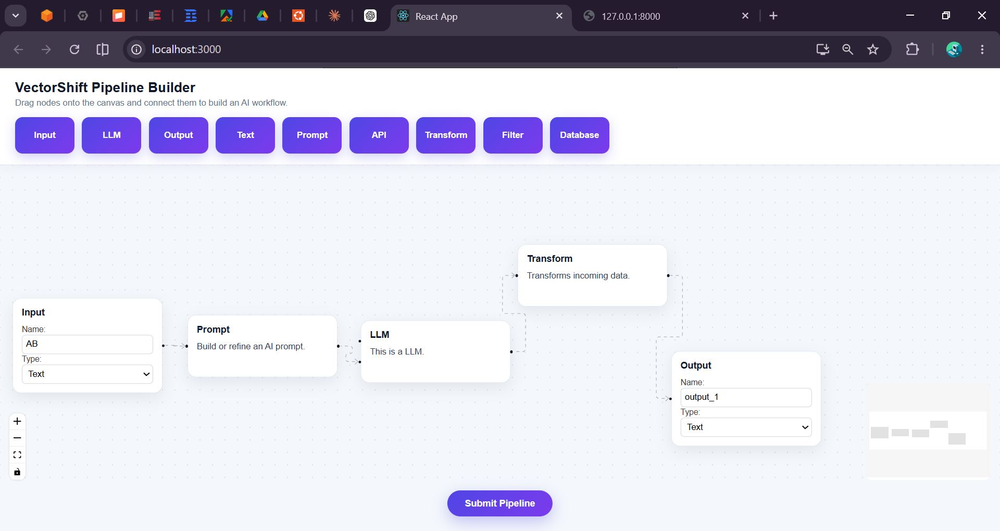
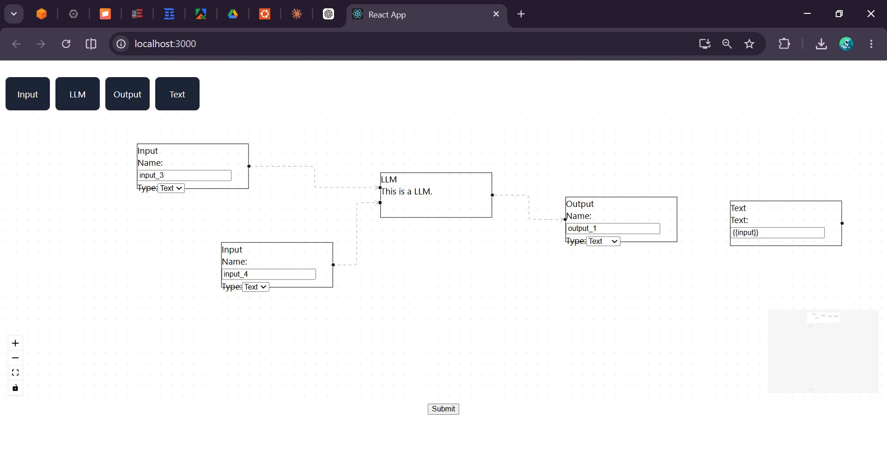
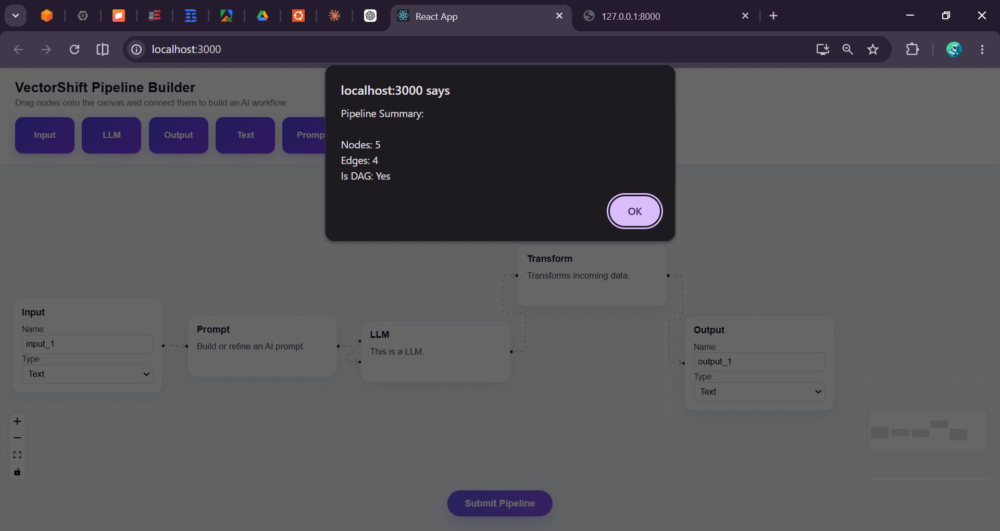
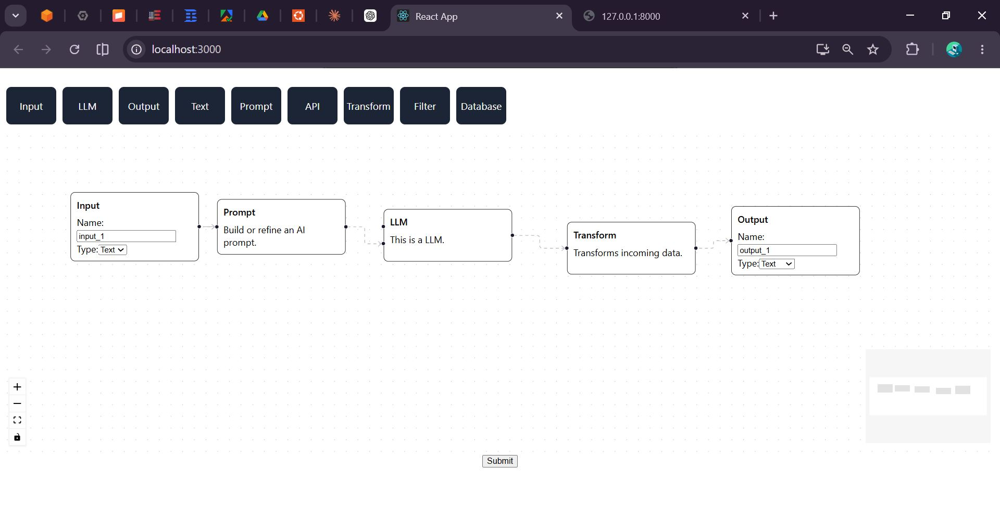
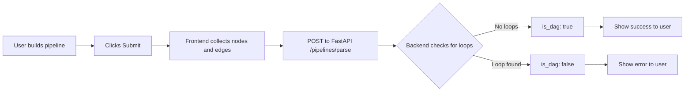

# 💼 VectorShift Pipeline Builder

<div align="center">


**A modern visual AI workflow pipeline builder — drag, connect, validate. Inspired by no-code orchestration systems like VectorShift and LangFlow.**

[Features](#-features) • [Screenshots](#-screenshots) • [Installation](#-installation) • [Usage](#-usage) • [Tech Stack](#-tech-stack)

</div>

---

## 🌟 Features

### Pipeline Editor
- 🎯 **Drag-and-Drop Canvas** — Place and move nodes freely on an interactive grid
- 🔗 **Dynamic Node Connections** — Draw edges between nodes to define data flow
- 🧩 **Reusable Node Architecture** — Every node follows the same extensible structure
- 🔄 **Real-time Visual Workflow Building** — See your pipeline come together instantly
- 🗑️ **Node & Edge Management** — Add, edit, and delete nodes and connections easily

### Variable Detection
- 🔍 **Auto Variable Extraction** — Type `{{variable}}` in any text node and it's detected automatically
- 🏷️ **Live Variable Chips** — Detected variables appear as visual badges in real time
- 🔁 **Cross-node Variable Reuse** — Variables from one node are available across the pipeline

### DAG Validation
- 🧠 **Backend DAG Check** — Submits the full pipeline to FastAPI for logical validation
- ✅ **Loop Detection** — Identifies circular connections that would break the flow
- 📊 **Pipeline Summary** — Returns node count, edge count, and DAG validity in one response

### Platform
- 🎨 **Modern Responsive UI** — Clean, dark-themed design with smooth animations
- 📱 **Mobile Friendly** — Works across all screen sizes
- ⚡ **FastAPI Backend** — Lightweight, fast, and easy to extend
- 🌐 **RESTful Communication** — React frontend and FastAPI backend talk cleanly over HTTP

---

## 🚀 Quick Start

### Prerequisites

- Node.js 16 or higher
- Python 3.8 or higher
- pip (Python package manager)

### Installation

1. **Clone the repository**
   ```bash
   git clone https://github.com/salamlakhan7/vectorshift-pipeline-builder.git
   cd vectorshift-pipeline-builder
   ```

2. **Start the Frontend**
   ```bash
   cd frontend
   npm install
   npm start
   ```

3. **Start the Backend**
   ```bash
   cd backend
   pip install -r requirements.txt
   uvicorn main:app --reload
   ```

4. **Access the application**
   - Frontend: `http://localhost:3000`
   - Backend API: `http://localhost:8000`
   - API Docs: `http://localhost:8000/docs`

> **⚠️ Important:** Make sure both frontend and backend are running at the same time. The pipeline validation feature requires the FastAPI server to be active.

---

## 📖 Usage Guide

### Building a Pipeline

1. **Open the editor** — The canvas loads with an empty grid, ready to build
2. **Drag a node** — Pick a node type from the left sidebar and drag it onto the canvas
3. **Fill in details** — Click a node to edit its label, prompt, or configuration
4. **Connect nodes** — Drag from one node's output port to another node's input port
5. **Add variables** — In any text field, type `{{variable_name}}` and it auto-detects
6. **Validate** — Click the **Submit Pipeline** button to check if your flow is a valid DAG

### Demo Workflow

```
Input → Prompt → LLM → Transform → Output
```

This is the simplest working pipeline. Data flows from the user's input, gets formatted into a prompt, processed by an LLM, optionally transformed, and delivered as final output — with no loops.

---

## 🛠️ Tech Stack

### Frontend
| Technology | Purpose |
|---|---|
| **React 18** | UI framework and component architecture |
| **ReactFlow** | Interactive node-based canvas and edge drawing |
| **Zustand** | Lightweight global state management |
| **CSS3** | Custom styling and animations |

### Backend
| Technology | Purpose |
|---|---|
| **FastAPI** | REST API server for pipeline validation |
| **Python 3.x** | DAG logic and graph traversal |
| **Uvicorn** | ASGI server to run FastAPI |

---

## 🧩 Supported Nodes

| Node | Purpose |
|---|---|
| **Input** | User input source — entry point of the pipeline |
| **Prompt** | AI prompt engineering — formats text with variables |
| **LLM** | Language model processing — sends prompt to an AI model |
| **Transform** | Data transformation — reshapes or modifies data |
| **Filter** | Conditional filtering — routes data based on rules |
| **API** | External API integration — connects to third-party services |
| **Database** | Data persistence — reads or writes to a data store |
| **Output** | Final output — the end result shown to the user |
| **Text** | Dynamic text templating — supports `{{variable}}` syntax |

---

## 🧠 DAG Validation

When you click **Submit Pipeline**, the frontend sends your workflow to the FastAPI backend. The backend runs a graph traversal to check whether the nodes and edges form a **Directed Acyclic Graph (DAG)** — meaning data flows in one direction with no circular loops.

### Example API Response

```json
{
  "num_nodes": 5,
  "num_edges": 4,
  "is_dag": true
}
```

### What each field means

| Field | Meaning |
|---|---|
| `num_nodes` | Total number of nodes in your pipeline |
| `num_edges` | Total number of connections between nodes |
| `is_dag` | `true` = valid flow, `false` = a loop was detected |

### Valid vs Invalid

```
✅ Valid:   Input → Prompt → LLM → Output      (no loops)
❌ Invalid: Input → LLM → Transform → LLM      (LLM loops back on itself)
```

---

## 📸 Screenshots

### Multi Input Flow


### Home UI


### DAG Validation
 

### Pipeline Connected



---

## 📁 Project Structure

```
vectorshift-pipeline-builder/
├── frontend/                        # React application
│   ├── src/
│   │   ├── nodes/                   # All node components
│   │   │   ├── InputNode.js         # User input node
│   │   │   ├── LLMNode.js           # Language model node
│   │   │   ├── OutputNode.js        # Final output node
│   │   │   ├── PromptNode.js        # Prompt engineering node
│   │   │   ├── TextNode.js          # Dynamic text with variable detection
│   │   │   └── ...                  # Other node types
│   │   ├── store.js                 # Zustand global state
│   │   ├── App.js                   # Root component
│   │   ├── toolbar.js               # Draggable node toolbar
│   │   ├── ui.js                    # Canvas and pipeline UI
│   │   └── submit.js                # Pipeline submit and validation
│   ├── public/
│   └── package.json
├── backend/                         # FastAPI application
│   ├── main.py                      # API routes and DAG validation logic
│   └── requirements.txt             # Python dependencies
├── Screenshots/                     # Application screenshots
└── README.md                        # This file
```

---

## 🔧 Configuration

### CORS (Cross-Origin)

The FastAPI backend is configured to accept requests from the React frontend. If you change ports, update the CORS settings in `backend/main.py`:

```python
from fastapi.middleware.cors import CORSMiddleware

app.add_middleware(
    CORSMiddleware,
    allow_origins=["http://localhost:3000"],
    allow_methods=["*"],
    allow_headers=["*"],
)
```

### Extending Nodes

Every node in `frontend/src/nodes/` follows the same pattern. To add a new node type:

1. Create `YourNode.js` in the `nodes/` folder
2. Register it in `App.js` under `nodeTypes`
3. Add it to the toolbar in `toolbar.js`

The node will automatically work with the existing connection and validation system.

---

## 🎨 Features in Detail

### Variable Detection System

The Text node and Prompt node detect `{{variable}}` patterns automatically as you type. No manual tagging needed.

```
Input text:  "Hello {{name}}, explain {{topic}} in {{language}}"
Detected:     {{name}}   {{topic}}   {{language}}
```

These become input handles on the node, allowing other nodes to connect and supply values dynamically.

### Pipeline Validation Flow



---

## 🧪 Testing the API

With the backend running, open `http://localhost:8000/docs` to access the interactive Swagger UI. You can test the `/pipelines/parse` endpoint directly from the browser by submitting sample node and edge data.

---

## 🤝 Contributing

Contributions are welcome! Please follow these steps:

1. Fork the repository
2. Create a feature branch (`git checkout -b feature/AmazingFeature`)
3. Commit your changes (`git commit -m 'Add some AmazingFeature'`)
4. Push to the branch (`git push origin feature/AmazingFeature`)
5. Open a Pull Request

---

## 📝 License

This project is licensed under the MIT License — see the [LICENSE](LICENSE) file for details.

---

## 👥 Author

- **Abdul Salam** — *Initial work* — [GitHub](https://github.com/salamlakhan7)

**Python | Django | AI Workflow Systems**

LinkedIn: [linkedin.com/in/abdul-salam-501b2025b](https://linkedin.com/in/abdul-salam-501b2025b)

---

## 🙏 Acknowledgments

- [ReactFlow](https://reactflow.dev/) for the excellent node-based canvas library
- [FastAPI](https://fastapi.tiangolo.com/) for the clean and fast Python API framework
- [Zustand](https://github.com/pmndrs/zustand) for simple and scalable state management
- VectorShift and LangFlow for the design inspiration

---

## 📞 Support

For support, email **salamlakhan7@gmail.com** or open an issue in the repository.

---


---

<div align="center">

**Made with ❤️ using React + FastAPI**

⭐ Star this repo if you find it helpful!

</div>
